# <div align="center">🚀 Welcome to My Digital Universe 🚀</div>

<div align="center">
  
  

</div>

---

<div align="center">
  
  ### 🌟 *Crafting Digital Experiences • One Line of Code at a Time* 🌟
  
  [](https://arefinportfolio.netlify.app/)
  [](https://www.linkedin.com/in/samsul-arefin-3a7804228/)
  [](https://www.facebook.com/samsularefinmilen12)
  [](mailto:samsularefinmilen@gmail.com)
  
</div>

---

## 🎯 About Me

<div align="center">
  
  ```javascript
  const samsul = {
    name: "Samsul Arefin Milen",
    location: "Bangladesh 🇧🇩",
    role: "Full Stack Developer",
    currentlyLearning: ["TypeScript", "Next.js", "GSAP", "MongoDB", "Express", "Node.js"],
    passions: ["Frontend Magic", "Creative Animations", "Problem Solving"],
    funFact: "I turn coffee ☕ into code 💻",
    motto: "Code • Create • Innovate • Repeat 🔄"
  };
  ```
  
</div>

---

## 🛠️ Tech Arsenal

<div align="center">

### 🎨 Frontend Technologies


### ⚡ Currently Mastering


### 💻 Programming Languages


### 🎨 Design & Tools


</div>

---

## 📊 GitHub Analytics Dashboard

<div align="center">
  
  
  
  

</div>

<div align="center">
  
  
  
</div>

---

## 🏆 GitHub Achievements

<div align="center">
  
  
  
</div>

---

## 🐍 Contribution Snake Game

<div align="center">
  
  
  
</div>

---

## 💼 Featured Project

<div align="center">

### 🌟 My Portfolio Website 🌟

<a href="https://arefinportfolio.netlify.app/" target="_blank">
  
</a>

*A modern, responsive portfolio showcasing my projects, skills, and journey as a developer. Built with cutting-edge technologies and smooth animations!*

**Tech Stack:** React • GSAP • Modern CSS • Responsive Design

</div>

---

## 📈 Activity Graph

<div align="center">
  
  
  
</div>

---

## 🎯 Current Focus

```mermaid
graph TD
    A[🎯 Learning Goals] --> B[TypeScript Mastery]
    A --> C[Next.js Advanced Features]
    A --> D[MERN Stack Proficiency]
    A --> E[Animation with GSAP]
    
    B --> F[🚀 Full Stack Projects]
    C --> F
    D --> F
    E --> F
    
    F --> G[🌟 Career Growth]
    
    style A fill:#00D9FF
    style F fill:#FF6B6B
    style G fill:#4ECDC4
```

<div align="center">



</div>

---

## 🎪 Fun Zone

<div align="center">

### 💡 Random Dev Joke


### 📊 Profile Insights


</div>

---

## 🤝 Let's Connect & Create Something Amazing!

<div align="center">
  
  *"The best way to predict the future is to create it."* ✨
  
  **I'm always open to:**
  - 🚀 Exciting project collaborations
  - 💡 Innovative ideas and discussions  
  - 🌱 Learning new technologies together
  - ☕ Coffee chats about code and creativity
  
  ### 📫 Reach Out to Me!
  
  [](https://arefinportfolio.netlify.app/)
  [](mailto:samsularefinmilen@gmail.com)
  
</div>

---

<div align="center">
  
  ### 🌟 Thanks for Visiting! Have an Amazing Day! 🌟
  
  
  
</div>
